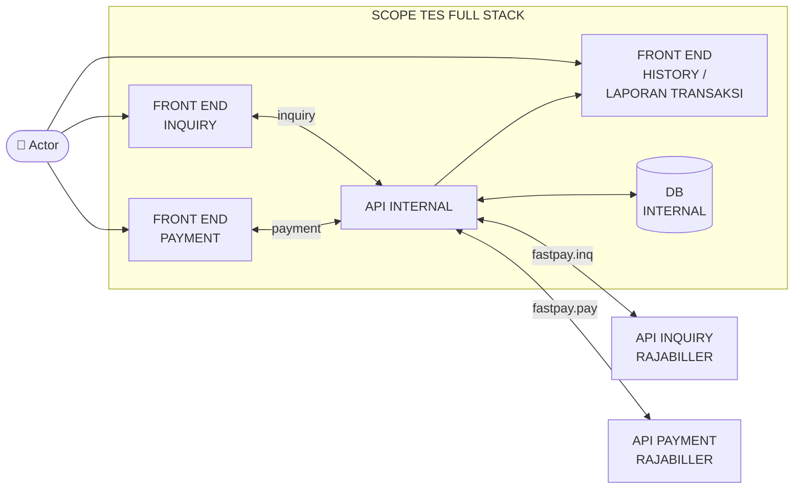

# Sistem Pembayaran Tagihan PDAM (Sidoarjo & Bondowoso)

Aplikasi Full-Stack Web Gateway Pembayaran Tagihan Air PDAM (PDAM Sidoarjo & PDAM Bondowoso) terintegrasi dengan API Rajabiller Fastpay, sesuai dokumen **Full Stack Dev Test (Rev 2.1.3)** PT. Bimasakti Multi Sinergi.

| Layer | Teknologi |
| :---- | :-------- |
| Runtime | Node.js `>= 22` + **Express 5** + TypeScript (ESM murni) |
| Database | **MySQL 8** via Drizzle ORM (`mysql2` pool) + migrasi versioned |
| Validasi | **Zod** — skema contract = single source of truth semua type domain |
| Frontend | **Preact + TSX** + Tailwind (esbuild bundle), UI gaya admin app-shell |
| Kualitas | Biome (lint/format), `tsc --noEmit`, 9 tes integrasi E2E, knip |

---

## Arsitektur

### Diagram Sistem (Scope Tes Full Stack)



### Alur Internal Request


```
HTTP request
   │
routes/api.routes.ts          deklarasi route
   ▼
controllers/*.controller.ts   parse + validasi body (zod) → panggil service
   ▼
services/*.service.ts         use case: orkestrasi, aturan bisnis, gateway
   ▼
repository/                   satu-satunya layer yang menyentuh MySQL (Drizzle)
   ▼
MySQL (bimasakti_pdam)

error path (satu pintu):
service throw ApiError(rc, msg, payload?)
   ▼
middleware/error.middleware.ts   ApiError.from() → normalisasi → rc dipetakan ke HTTP status
                                 (01/02/03→400, 04→404, 33→409, 99→500) + envelope spec
```

Prinsip yang ditegakkan:

- **Contract sekali, di `src/domain/`** — setiap file domain memuat skema Zod + type turunan (`z.infer`) + aturan terkait. Tidak ada shape yang ditulis dua kali.
- **Controllers tanpa try/catch** — Express 5 meneruskan async rejection ke error middleware global; controller hanya *throw*.
- **Satu gaya error** — semua service melempar `ApiError` (bukan `Object.assign(new Error(...), { rc })`).
- **`config/` = env saja** — tanpa data domain. Katalog produk tinggal di `domain/product.ts`.
- **Import ESM eksplisit** — `./foo.js` di file `.ts` (syarat `moduleResolution: NodeNext`).

### Kontrak Domain (`src/domain/`)

| File | Isi | Gaya |
| :--- | :-- | :--- |
| `product.ts` | Katalog produk + `pdamProductCodeSchema` + guard — **satu deklarasi katalog, type/schema/guard di-derive** | zod + `as const` |
| `inquiry.ts` | `specBillSchema`, `inquiryDataSchema`, `inquiryRequestSchema` | zod |
| `payment.ts` | `paymentRequestSchema` | zod |
| `transaction.ts` | `transactionRecordSchema` → `TransactionRecord` | zod |
| `rajabiller.ts` | Wire format request/response upstream (`.passthrough()` untuk field dinamis) | zod |
| `protocol.ts` | `RC` (kode bisnis spec) + `envelopeSchema` + builder `envelope()` | zod + `as const` |
| `errors.ts` | `ApiError` + normalizer `ApiError.from()` | class |

### Idempotensi Pembayaran

`POST /api/payment` dengan `ref2` yang sudah tersimpan **ditolak `rc "33"`** dan mengembalikan transaksi asli + struknya — tanpa mengirim request kedua ke Rajabiller. Ditegakkan dua lapis: pre-check di `paymentService` + `UNIQUE(ref2)` di MySQL (race-free; lost race tertangkap dari `ER_DUP_ENTRY`).

---

## Alur Transaksi (sesuai spec)

1. User isi **select nama PDAM + input idpel** di frontend, klik Inquiry.
2. Frontend → **API Internal** `POST /api/inquiry` → **Rajabiller** `fastpay.inq`.
3. Rincian tagihan (format json point 4) ditampilkan, user lanjut Payment.
4. Frontend → **API Internal** `POST /api/payment` → **Rajabiller** `fastpay.pay` (nominal & ref2 dari respon inquiry).
5. API Internal simpan transaksi ke **MySQL internal** (Drizzle ORM) → tampilkan + unduh struk.
6. **History** membaca DB internal, bisa ditampilkan berulang-ulang.

## List Produk Test (spec)

| Produk          | Kode Produk | Idpel      |
| :-------------- | :---------- | :--------- |
| PDAM SIDOARJO   | `WASDA`     | `01002676` |
| PDAM BONDOWOSO  | `WABONDO`   | `09000879` |

Tombol pintasan Test IDPEL tersedia di UI (terisi otomatis dari `GET /api/products`).

## Format API Internal (spec point 4)

Semua endpoint mengembalikan envelope `{ "rc": "00", "ket": "sukses", "data": ... }`.

Contoh respon inquiry (WASDA):

```json
{
  "rc": "00",
  "ket": "Inquiry tagihan berhasil didapatkan.",
  "data": {
    "idpel": "01002676",
    "nometer": "01/II/013/0083/6D",
    "alamat": "SEKAWAN SEJUK C.16A",
    "nama": "PERM. BUMI CITRA FAJAR",
    "nominal": 294500,
    "admin": 10806,
    "total_bayar": 305306,
    "jumlah_bulan": "6",
    "data_bill": {
      "blth1": { "air": 40500, "denda": 7500, "nonair": 0, "meter_awal": 0, "meter_akhir": 0, "bulan": "5", "tahun": "2024" },
      "blth2": { "...": "loop sejumlah billquantity dari respon inq/pay" }
    },
    "ref1": "INQ_...",
    "ref2": "28189..."
  }
}
```

## Endpoint API Internal

| Endpoint                                  | Fungsi                                                        |
| :---------------------------------------- | :------------------------------------------------------------ |
| `GET /api/products`                       | Daftar produk + idpel sample                                   |
| `POST /api/inquiry`                       | `{ productCode, customerId }` → data tagihan (format di atas)  |
| `POST /api/payment`                       | `{ productCode, customerId, ref1, ref2, nominal }` → simpan DB + struk |
| `GET /api/transactions?limit=100`         | Riwayat transaksi (max 500)                                    |
| `GET /api/transactions/:id`               | Detail transaksi + teks struk                                  |
| `GET /api/transactions/:id/receipt`       | Unduh struk `.txt` (attachment)                                |
| `GET /api/readme`                         | Isi README.md (untuk tab "Panduan & README" di UI)             |

## Struk (spec point 8)

Tersedia dua layout sesuai contoh: Sidoarjo (rincian bulanan + denda + admin) dan Bondowoso (plus `PEMAKAIAN M3` dan `BEBAN`). Tanggal format `dd-mm-yyyy HH:mm:ss`, nominal pakai pemisah titik (`40.500`), label periode `AGS2014`. Struk dapat dilihat di modal, dicetak, dan diunduh sebagai `.txt`.

---

## Menjalankan Program

### 1. Prasyarat

- **Node.js**: `>= 22` (direkomendasikan versi terbaru LTS)
- **npm**: `>= 10.x`
- **Database**: MySQL 8.x / MariaDB lokal atau cloud (Laragon, FreeDB, PlanetScale, dsb.)

### 2. Konfigurasi Lingkungan (`.env`)

Salin file konfigurasi contoh:

```bash
cp .env.example .env
```

Sesuaikan nilai konfigurasi di file `.env`:

```ini
PORT=3000
NODE_ENV=development

# Database MySQL / Cloud
DB_HOST=127.0.0.1
DB_PORT=3306
DB_USER=root
DB_PASSWORD=your_password_here
DB_NAME=bimasakti_pdam
DB_TEST_NAME=bimasakti_pdam_test

# Kredensial API Rajabiller Fastpay
RAJABILLER_URL=https://c-dev-partnerlink.rajabiller.com/json/index.php
RAJABILLER_UID=SP300203
RAJABILLER_PIN=311575
```

### 3. Instalasi Dependensi

```bash
npm install
```

### 4. Migrasi Database

```bash
npm run build        # db:migrate menjalankan dist/scripts/migrate.js
npm run db:migrate
```

*(Database + tabel `transactions` + `__drizzle_migrations` dibuat otomatis bila belum ada. Untuk iterasi cepat tanpa build: `npx tsx src/scripts/migrate.ts`.)*

### 5. Menjalankan Aplikasi

#### Mode Development (Hot-Reloading)

```bash
npm run dev
```

#### Mode Produksi (Build + Start)

```bash
npm run build
npm start
```

**Keterangan Build Pipeline** (`scripts/build.mjs`):

- Membersihkan direktori `dist/` & `public/`.
- Otomatis mengeliminasi komentar kode (`decomment`).
- Mem-bundle client **Preact TSX** ke `views/js/app.js` & minify CSS.
- Mem-bundle server TypeScript ESM ke `dist/server.js`.
- Pre-kompresi multi-tier: **Zstandard (.zst)**, **Brotli (.br)**, dan **Gzip (.gz)** — disajikan oleh `middleware/static.middleware.ts` sesuai `Accept-Encoding`.

Akses aplikasi di browser: **http://localhost:3000**


## Pengujian & Kualitas Kode

```bash
# Build + seluruh test suite E2E (9 integration tests, DB terisolasi bimasakti_pdam_test)
npm test

# Pemeriksaan linter (Biome) & TypeScript
npm run lint
npm run typecheck

# Audit dead-code / unneeded dependencies
npx knip
```

`npm test` butuh MySQL berjalan dan `.env` terisi — database test dibuat/migrasi/truncate otomatis per run, DB development tidak tersentuh.

Cakupan 9 tes: daftar produk → validasi inquiry (envelope rc/ket) → inquiry WASDA (bentuk sesuai spec) → inquiry WABONDO → payment + layout struk sesuai spec → penolakan double-payment (idempoten, tanpa row kedua) → history + guard limit NaN → unduh struk + path 404 → render UI.

## Struktur Folder

```text
├── api/
│   └── index.js                        # Vercel Serverless Function entry point
├── drizzle/                            # Drizzle SQL migration files (+ meta/_journal)
├── scripts/
│   ├── build.mjs                       # Esbuild bundling, comment stripper, multi-compression
│   ├── clean.mjs                       # Pembersih dist/ & public/
│   └── strip-comments.mjs
├── src/
│   ├── server.ts                       # Express 5 bootstrap (25 baris)
│   ├── config/
│   │   ├── constants.ts                # Env constants saja (PORT, DB_*, NODE_ENV)
│   │   └── rajabiller.ts               # Kredensial gateway Rajabiller
│   ├── controllers/                    # HTTP adapters: parse → validasi zod → service (tanpa try/catch)
│   │   ├── inquiry.controller.ts
│   │   ├── payment.controller.ts
│   │   └── history.controller.ts
│   ├── domain/                         # Contract = zod schema + type turunan + aturan domain
│   │   ├── product.ts                  #   katalog produk, enum schema, guard
│   │   ├── inquiry.ts                  #   skema tagihan & inquiry
│   │   ├── payment.ts                  #   skema request pembayaran
│   │   ├── transaction.ts              #   entitas transaksi tersimpan
│   │   ├── rajabiller.ts               #   wire format upstream
│   │   ├── protocol.ts                 #   RC + envelope spec point 4
│   │   └── errors.ts                   #   ApiError + normalizer from()
│   ├── middleware/
│   │   ├── error.middleware.ts         # Funnel error global: rc → HTTP status + envelope
│   │   └── static.middleware.ts        # Negosiasi kompresi zstd/br/gz
│   ├── repository/                     # Satu-satunya layer yang menyentuh MySQL
│   │   ├── connection.ts               #   Pool mysql2 + instance Drizzle
│   │   ├── schema.ts                   #   Definisi tabel Drizzle
│   │   └── transaction.repository.ts
│   ├── routes/
│   │   └── api.routes.ts               # Deklarasi route /api/*
│   ├── scripts/
│   │   └── migrate.ts                  # Runner migrasi (auto-create database)
│   ├── services/                       # Use case & integrasi eksternal
│   │   ├── inquiry.service.ts
│   │   ├── payment.service.ts          #   Idempotensi (pre-check + UNIQUE ref2)
│   │   ├── history.service.ts
│   │   ├── rajabiller.service.ts       #   Client JSON API Rajabiller
│   │   └── receipt.service.ts          #   Formatter struk plain-text (2 layout)
│   ├── utils/                          # Helper pure, bebas framework
│   │   ├── helpers.ts                  #   toInt()
│   │   └── terbilang.ts                #   angka → kata
│   └── views/                          # Frontend Preact TSX (admin app-shell)
│       ├── main.tsx                    #   Entry render
│       ├── app.tsx                     #   Shell: sidebar, topbar, tab, state
│       ├── utils.ts
│       ├── api/
│       │   └── pdam.api.ts             #   Fetcher layer frontend
│       └── components/                 #   inquiry.form, inquiry.result, payment.confirm.modal,
│           │                           #   receipt.modal, history.table, flow.stepper, api.docs,
│           │                           #   readme.viewer, sidebar, toast, header
│           └── ui/                     #   Primitif UI reusable
├── views/                              # Static host: index.html, css/, js/ (hasil bundle), kompresi .zst/.br/.gz
├── test_integration.mjs                # 9 tes integrasi E2E
├── drizzle.config.ts                   # Konfigurasi drizzle-kit
├── vercel.json                         # Konfigurasi deploy Vercel
└── package.json
```

## Deployment ke Vercel

Aplikasi siap dideploy langsung ke Vercel:

1. Hubungkan repository GitHub ke Vercel.
2. Di Vercel Project Settings:
   - **Framework Preset**: `Other` (dikelola oleh `vercel.json`)
   - **Build & Output Settings**: Biarkan default (Build: `npm run build`, Output: `views`)
   - **Environment Variables**: Tambahkan variabel dari `.env` (`DB_HOST`, `DB_USER`, `DB_PASSWORD`, `DB_NAME`, `RAJABILLER_*`).
3. Klik **Deploy**.

> Catatan: gunakan MySQL yang dapat diakses publik (mis. PlanetScale/FreeDB) — Vercel serverless tidak bisa menjangkau `127.0.0.1` lokal.
